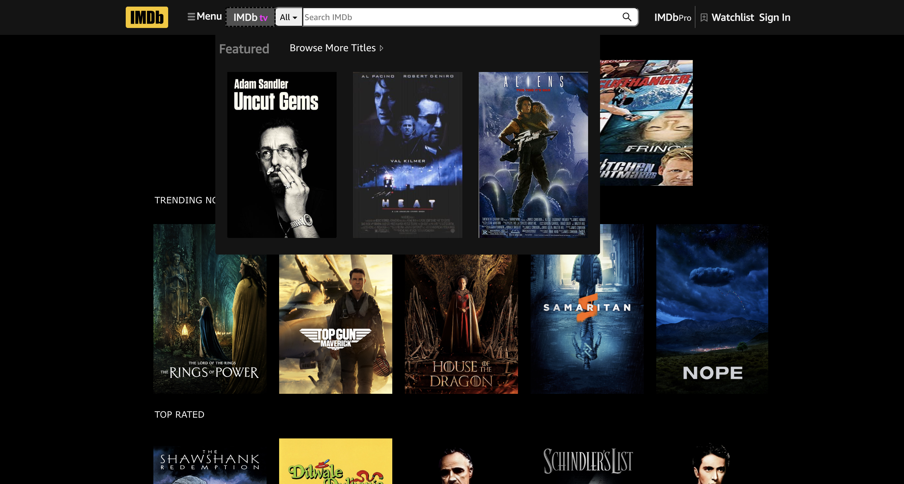

# IMDb-clone

<!-- PROJECT LOGO -->
<br />
<div align="center">
  <a href="https://github.com/Anthony-Cortese/IMDb-Clone">
    
  </a>

<h1 align="center">IMDb-Clone</h1>

  <p align="center">
    <br />
    <a href="https://akc-imdb.netlify.app/"><strong>View Website</strong></a>
    <br />
    <br />
</div>

## Description

After watching and coding along with several tutorials online I wanted to test my overall knowledge and implementation of React and CSS so I decided I would build my favorite website from scratch. This felt like such an undertaking to begin-- but once I began I found so much joy in adding new features, and completely making this website MINE.


## Getting Started

### Installation

Install NPM packages

- npm

```sh
npm install
```

- yarn

```sh
yarn install
```

## Roadmap/Features

- [ ] Fully functional navigation bar.
  - [ ] Each button takes you to a new page, some buttons even have hover capabilities.
- [ ] The play buttons on the home screen next to movie posters will open up a trailer which is unique to the button pressed.
- [ ] The "Coming Soon to Theatres" section are all short films that I have directed/edited.
- [ ] On the IMDbTV page I used the TMDB API to retrieve movie poster data based on different genres.
  - [ ] Each movie poster is made clickable to open a movie trailer from YouTube.
- [ ] Responsive website allows information to be hidden and revealed with a horizontal scroll.
  - [ ] Featured Today, Fan Favorites, Exclusive Videos, Explore, On TV, Trending Celebrities, and Top News all have the horizontal scroll functionality!

## Usage

<div align="center">
    
</div>

    

    

    

    

## Credits

I credit IMDb for making such a great website, and giving me my inspiration.

<!-- Deployed site: https://akc-imdb.netlify.app/ -->
